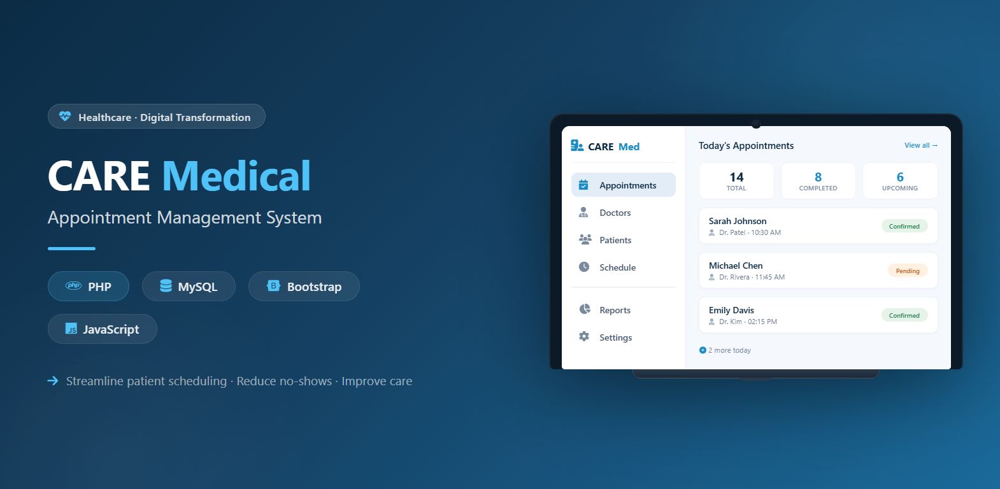

<p align="center">
  
</p>

# 🏥 CARE Medical Appointment System

A modern and responsive healthcare management system developed using PHP and MySQL. The system allows patients to search doctors, book appointments, doctors to manage their profiles and availability, and administrators to manage the complete healthcare platform.

---

## ✨ Features

### 👨‍💼 Admin
- Secure Admin Login
- Dashboard Overview
- Manage Cities
- Manage Doctors
- Manage Patients
- Manage Diseases
- Manage Medical News
- View Appointments

### 👨‍⚕️ Doctor
- Secure Login
- Manage Profile
- Update Availability
- View Appointment List

### 🧑 Patient
- Register & Login
- Search Doctors
- Filter by City & Specialization
- View Doctor Profiles
- Book Appointments
- View Appointment History

---

## 🛠 Technologies Used

- PHP
- MySQL
- HTML5
- CSS3
- JavaScript
- Bootstrap 5

---

## 📸 Project Preview

### 🏠 Home Page


---

### 👨‍💼 Admin Dashboard


---

### 🔍 Doctor Search


---

### 📅 Appointment Booking


---

## 🚀 Installation

1. Download or Clone this repository.
2. Copy the project folder into the `htdocs` directory.
3. Import the SQL file from the `database` folder into MySQL.
4. Update the database connection if required.
5. Start Apache and MySQL using XAMPP.
6. Open the project in your browser.

Example:

http://localhost/CARE-Medical/

---

## 📂 Project Structure

```
CARE-Medical
│
├── css
├── database
├── images
├── includes
├── js
├── about.php
├── auth.php
├── contact.php
├── dashboard.php
├── finddoctor.php
└── index.php
```

---

## 📌 Future Improvements

- Email Notifications
- Online Payment Integration
- Patient Medical History
- Doctor Ratings & Reviews
- Online Video Consultation
- Admin Reports & Analytics

---

## 👨‍💻 Developed By

**Umar Farooq**

If you found this project useful, don't forget to ⭐ this repository.
